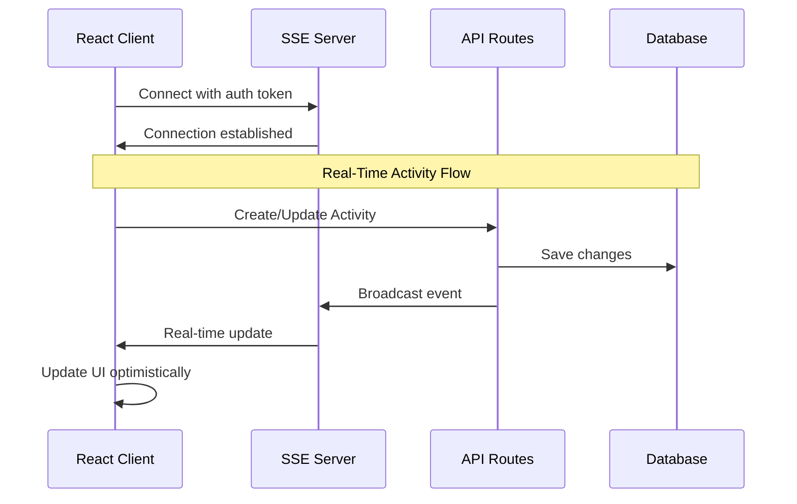
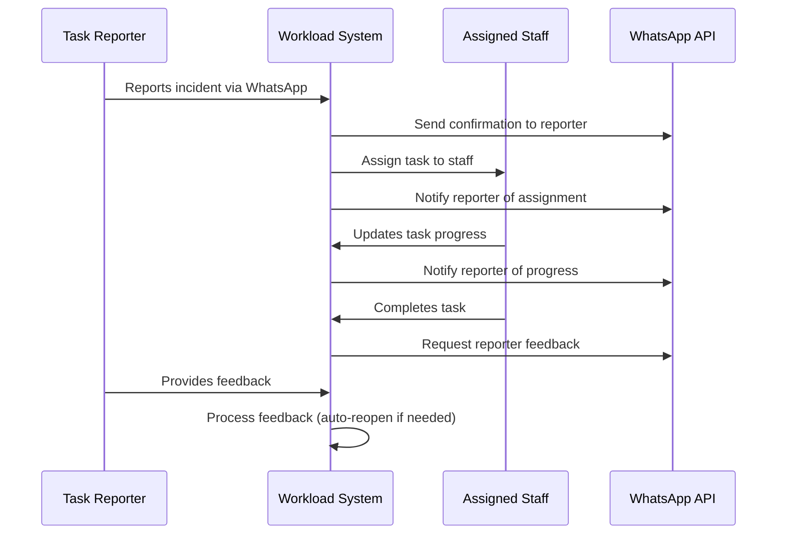

# Workload Insights Dashboard: Comprehensive UX Architecture Plan

## Executive Summary
This document outlines the comprehensive architectural design to transform the Workload Insights Dashboard from a single-user static reporting system into a collaborative, real-time, mobile-first task management platform that scales with organizational needs.

## Current State Assessment

### System Limitations Identified
- Single-user task assignments limit collaboration effectiveness
- Manual page refreshes required for data updates
- Category-focused visualizations don't show actionable workload distribution
- Mobile experience inadequate for field workers who are primary users
- One-way communication with task reporters creates feedback gaps
- Limited real-time collaboration features

### Target State Vision
**Transform Into:**
- Multi-user collaborative task management system
- Real-time updates with live collaboration capabilities
- Mobile-first responsive design optimized for field workers
- Bi-directional communication with task reporters
- AI-powered workload insights and automated recommendations
- Scalable notification system across multiple channels

## Key Architectural Designs

### 1. Multi-User Assignment System Architecture

#### Database Schema Enhancement
```sql
-- New junction table for multi-user assignments
CREATE TABLE activity_assignments (
  id VARCHAR PRIMARY KEY DEFAULT cuid(),
  activity_id VARCHAR NOT NULL,
  user_id VARCHAR NOT NULL,
  assigned_at TIMESTAMP DEFAULT NOW(),
  assigned_by VARCHAR NOT NULL,
  assignment_type VARCHAR DEFAULT 'primary', -- 'primary', 'secondary', 'observer'
  status VARCHAR DEFAULT 'active', -- 'active', 'completed', 'removed'
  role_instructions TEXT,
  receive_notifications BOOLEAN DEFAULT TRUE,
  
  FOREIGN KEY (activity_id) REFERENCES activities(id) ON DELETE CASCADE,
  FOREIGN KEY (user_id) REFERENCES users(id),
  FOREIGN KEY (assigned_by) REFERENCES users(id),
  UNIQUE(activity_id, user_id)
);
```

#### Key Features
- **Role-Based Assignments**: Primary (responsible), Secondary (support), Observer (informed)
- **Backward Compatibility**: Maintains existing `assigned_to_user_id` field during migration
- **Notification Preferences**: Individual control over notification settings
- **Assignment History**: Complete audit trail of assignment changes

### 2. Real-Time Updates Infrastructure

#### Architecture Overview


#### Technical Implementation
- **Server-Sent Events (SSE)**: Primary real-time mechanism for Vercel compatibility
- **WebSocket Fallback**: For advanced collaborative features
- **Optimistic Updates**: Immediate UI response with automatic rollback on failure
- **Connection Management**: Automatic reconnection and heartbeat monitoring

### 3. Mobile-First Responsive Design Strategy

#### Design Principles
- **Touch-First Design**: 44px minimum touch targets, thumb-friendly navigation zones
- **Progressive Enhancement**: Core functionality works without JavaScript
- **Adaptive Layout**: Bottom navigation for mobile, side navigation for desktop
- **Performance Budget**: 3-second load time on 3G connections

#### Component Architecture
```typescript
// Mobile-first component structure
interface MobileComponentProps {
  isMobile: boolean;
  viewMode: 'compact' | 'detailed' | 'list';
  touchOptimized: boolean;
}

// Touch optimization patterns
const TOUCH_TARGET_SIZE = '44px';
const THUMB_ZONE = 'bottom 25% of screen';
const SWIPE_GESTURES = ['left: quick action', 'right: details', 'up: dismiss'];
```

#### Key Mobile Features
- **Bottom Navigation**: Primary navigation optimized for thumb reach
- **Swipe Gestures**: Intuitive interactions for common task actions
- **Pull-to-Refresh**: Standard mobile pattern for data updates
- **Offline Capabilities**: Service worker for basic offline functionality

### 4. Enhanced WhatsApp Reporter Communication

#### Bi-Directional Communication Flow


#### Notification Types
1. **Assignment Confirmation**: "Your report has been assigned to [Staff Name]"
2. **Progress Updates**: Real-time updates on task progress
3. **Completion Notification**: Task completion with feedback request
4. **Feedback Processing**: Automatic task reopening based on reporter feedback

#### Implementation Features
- **Personalized Messages**: Role-specific instructions and context
- **Feedback Intelligence**: Natural language processing for feedback sentiment
- **Escalation Logic**: Automatic escalation for unresolved feedback
- **Communication History**: Complete conversation tracking in dashboard

### 5. User Workload Visualization System

#### Analytics Engine
```typescript
interface UserWorkloadData {
  userId: string;
  userName: string;
  userRole: string;
  workloadMetrics: {
    activeAssignments: number;
    completedThisWeek: number;
    overdueAssignments: number;
    averageCompletionTime: number; // hours
    completionRate: number; // percentage
    workloadScore: number; // calculated complexity weight
    capacityUtilization: number; // percentage of theoretical max
  };
  categoryExpertise: Array<{
    categoryId: string;
    assignmentCount: number;
    successRate: number;
  }>;
}
```

#### Visualization Modes
- **Active Assignments**: Current workload distribution across team
- **Completion Rate**: Individual and team performance metrics
- **Efficiency**: Average completion times and response rates
- **Capacity Utilization**: How much of theoretical capacity is being used

#### Intelligent Insights
- **Workload Balance Detection**: Identifies overloaded and underutilized team members
- **Automated Recommendations**: Suggests task redistribution and process improvements
- **Performance Benchmarking**: Individual metrics against team and historical averages
- **Predictive Analytics**: Forecasts workload trends and capacity planning

### 6. Performance Optimization Strategy

#### Code Splitting & Lazy Loading
```typescript
// Strategic component loading
const LazyActivityFeed = lazy(() => import('./ActivityFeed'));
const LazyCharts = lazy(() => import('./charts/ActivityCharts'));
const LazyTaskModal = lazy(() => import('./TaskDetailsModal'));

// Progressive loading strategy
interface LoadingStrategy {
  immediate: 'Summary cards, navigation, basic layout';
  onDemand: 'Charts, detailed views, heavy components';
  background: 'Analytics, reports, admin features';
}
```

#### Database Optimization
- **Optimized Queries**: Efficient JOINs and indexing strategy
- **Connection Pooling**: Managed database connections for scalability  
- **Caching Strategy**: Multi-level caching (Redis, CDN, browser)
- **Query Performance**: Sub-100ms response times for common operations

## Implementation Roadmap

### Phase 1: Foundation & Critical UX Fixes (Weeks 1-4)
**Priority: CRITICAL - Core User Experience**

#### 1.1 Mobile-First Responsive Design
- Enhanced touch targets and thumb-friendly navigation
- Bottom navigation system for mobile workflow
- Collapsible filter controls with mobile-optimized interface
- Touch-optimized activity cards with gesture support

**Deliverables:**
- `MobileAppShell.tsx` with adaptive navigation
- `MobileActivityCard.tsx` with touch optimization
- `MobileFilterControls.tsx` with collapsible interface
- `useTouchOptimization.ts` hook for enhanced interactions

**Success Metrics:**
- Touch target compliance (min 44px)
- 40% reduction in mobile task completion time
- Elimination of horizontal scrolling
- Thumb-friendly navigation zones

#### 1.2 Real-Time Updates Foundation
- Server-Sent Events implementation for Vercel compatibility
- Connection management with automatic reconnection
- Basic activity updates and status change propagation
- Real-time connection status indicators

**Deliverables:**
- `/api/events/route.ts` - Server-sent events endpoint
- `useRealtimeUpdates.ts` - Real-time client hook
- `RealtimeConnectionIndicator.tsx` - Connection status
- Real-time activity creation and updates

**Success Metrics:**
- Sub-second update propagation
- 99% connection uptime
- Elimination of manual page refreshes
- Real-time user presence indicators

### Phase 2: Multi-User & Communication (Weeks 5-8)
**Priority: HIGH - Collaboration & Communication**

#### 2.1 Multi-User Assignment System
- Database schema migration with backward compatibility
- Multi-assignment API endpoints and business logic
- Enhanced UI for multi-user assignment management
- Role-based assignment logic and permissions

**Deliverables:**
- `ActivityAssignment` database model implementation
- Enhanced assignment APIs supporting multiple users
- `MultiUserAssignmentModal.tsx` component
- Role-based notification system

**Success Metrics:**
- Support for 5+ users per task
- Clear role differentiation in UI
- Efficient multi-user notification delivery
- Backward compatibility maintained

#### 2.2 WhatsApp Reporter Communication
- Comprehensive reporter notification service
- Enhanced webhook processing for bi-directional communication
- Communication history dashboard integration
- Automated feedback processing and task reopening

**Deliverables:**
- `reporter-notification-service.ts` - Complete notification system
- Enhanced webhook processing for feedback
- `ReporterCommunicationPanel.tsx` - Communication dashboard
- Automated follow-up and escalation logic

**Success Metrics:**
- 90% reporter notification delivery rate
- 50% increase in reporter feedback responses
- Automated issue reopening based on feedback
- Complete communication history tracking

#### 2.3 User Workload Visualization
- Advanced workload analytics engine
- Interactive workload visualization replacing category chart
- Team balance indicators with automated recommendations
- Individual performance tracking and benchmarking

**Deliverables:**
- `workload-analytics.ts` - Comprehensive analytics engine
- `UserWorkloadChart.tsx` - Interactive workload visualization
- `WorkloadViewControls.tsx` - Multiple view modes
- Intelligent workload balancing recommendations

**Success Metrics:**
- Replace category chart with actionable insights
- Visual workload imbalance detection
- Automated rebalancing suggestions
- Individual performance tracking

### Phase 3: Advanced UX & Polish (Weeks 9-12)
**Priority: MEDIUM - Enhanced User Experience**

#### 3.1 Advanced Mobile Features
- Swipe gesture system for intuitive interactions
- Pull-to-refresh functionality for data updates
- Haptic feedback integration for native feel
- Progressive Web App capabilities with offline support

#### 3.2 Collaborative Features
- Live user presence indicators
- Collaborative note editing with conflict resolution
- Threaded comments system for activities
- Team-wide activity timeline visualization

#### 3.3 Advanced Analytics & Insights
- Predictive workload forecasting
- Individual and team performance benchmarking
- Historical trend analysis with actionable insights
- Customizable dashboard widgets

### Phase 4: Optimization & Scale (Weeks 13-16)
**Priority: LOW - Performance & Scalability**

#### 4.1 Performance Optimization
- Comprehensive code splitting and lazy loading
- Database query optimization and advanced indexing
- Multi-level caching strategy implementation
- Bundle size optimization (target: 40% reduction)

#### 4.2 Advanced Integrations
- Multi-channel notification system (Email, SMS, Push)
- Calendar integration for deadline management
- Advanced reporting and export capabilities
- Comprehensive API documentation and SDK

## Technical Specifications

### Architecture Patterns
- **Mobile-First Development**: Every feature designed for mobile, enhanced for desktop
- **Progressive Enhancement**: Core functionality works without JavaScript
- **Real-Time by Default**: All updates propagated immediately across clients
- **Accessibility First**: WCAG 2.1 AA compliance throughout application
- **Performance Budget**: Strict 3-second load time requirement on 3G

### Database Design Principles
- **Backward Compatibility**: All schema changes maintain existing functionality
- **Performance Optimization**: Strategic indexing for common query patterns
- **Data Integrity**: Comprehensive foreign key relationships and constraints
- **Audit Trail**: Complete history tracking for all critical operations

### Security Considerations
- **Authentication**: Enhanced session management with real-time token validation
- **Authorization**: Role-based access control for all multi-user features
- **Data Privacy**: GDPR compliance with automatic PII redaction
- **Communication Security**: End-to-end encryption for sensitive notifications

## Success Metrics Framework

### User Experience Metrics
```typescript
interface UXMetrics {
  efficiency: {
    taskAssignmentTime: '< 8 seconds (from 30s)';
    statusUpdateTime: '< 3 seconds';
    reportCreationTime: '< 15 seconds';
  };
  
  collaboration: {
    multiUserAdoption: '> 70% of tasks use multi-user assignments';
    realtimeEngagement: '> 85% of users actively use real-time features';
    communicationResponse: '< 2 hours average response time';
  };
  
  mobile: {
    mobileTouchAccuracy: '> 95% first-attempt success rate';
    mobileTaskCompletion: '> 90% completion rate on mobile';
    offlineCapability: '> 80% of core functions work offline';
  };
  
  satisfaction: {
    userSatisfactionScore: '> 4.5/5 in post-implementation survey';
    taskCompletionRate: '> 92% of assigned tasks completed';
    systemAdoptionRate: '> 95% of staff actively using system';
  };
}
```

### Technical Performance Metrics
- **Page Load Time**: < 3 seconds on 3G connections
- **Real-Time Latency**: < 500ms for update propagation
- **Database Performance**: < 100ms for 95% of queries
- **Mobile Performance**: > 60fps animations and interactions
- **Reliability**: 99.9% uptime with graceful degradation

## Risk Mitigation Strategy

### Technical Risks
1. **Database Migration Risk**: Implement backward-compatible schema changes with feature flags
2. **Real-Time Performance Risk**: Implement graceful degradation to polling fallback
3. **Mobile Performance Risk**: Progressive loading and aggressive lazy rendering
4. **Integration Complexity**: Phased rollout with comprehensive testing

### User Adoption Risks
1. **Change Management**: Comprehensive training program with hands-on workshops
2. **Feature Complexity**: Gradual feature introduction with user feedback loops
3. **Performance Impact**: Continuous monitoring with automatic rollback capabilities
4. **Support Requirements**: Enhanced documentation and in-app guidance system

## Resource Requirements

### Development Team
- **3-4 Full-Stack Developers**: React/TypeScript, Node.js, PostgreSQL expertise
- **1 UX Designer**: Mobile-first design, accessibility, user research
- **1 DevOps Engineer**: Real-time infrastructure, monitoring, deployment
- **1 QA Engineer**: Mobile testing, accessibility testing, performance testing

### Infrastructure Requirements
- **Enhanced Database Instance**: Increased capacity for real-time features
- **Real-Time Infrastructure**: SSE/WebSocket support, connection management
- **Mobile Testing Devices**: iOS and Android devices for comprehensive testing
- **Monitoring Systems**: Real-time performance monitoring and alerting

### Timeline & Budget
- **Total Implementation Time**: 16 weeks (4 months)
- **Development Effort**: ~640 person-hours across all phases
- **Training Program**: 2-week user training post-implementation
- **Support Period**: 4-week intensive support during rollout

## Conclusion

This comprehensive architecture plan transforms the Workload Insights Dashboard from a static reporting tool into a dynamic, collaborative platform that meets the evolving needs of modern organizations. The phased implementation approach ensures continuous value delivery while minimizing risk and maintaining system stability.

The mobile-first, real-time, collaborative approach addresses the core limitations identified in the current system while providing a scalable foundation for future enhancements. With clear success metrics, risk mitigation strategies, and detailed implementation guidance, this plan provides a roadmap for creating a world-class task management platform.

Key success factors include:
- **Incremental Implementation**: Each phase delivers immediate value
- **Backward Compatibility**: No disruption to current workflows
- **User-Centered Design**: Focus on actual user needs and workflows
- **Performance First**: Strict performance budgets and optimization
- **Scalability**: Architecture designed for organizational growth

The expected impact includes dramatic improvements in task completion efficiency, team collaboration effectiveness, and overall user satisfaction, positioning the organization for enhanced operational excellence.

---

**Document Version**: 1.0  
**Last Updated**: January 3, 2025  
**Next Review**: Phase 1 Completion (4 weeks from start)